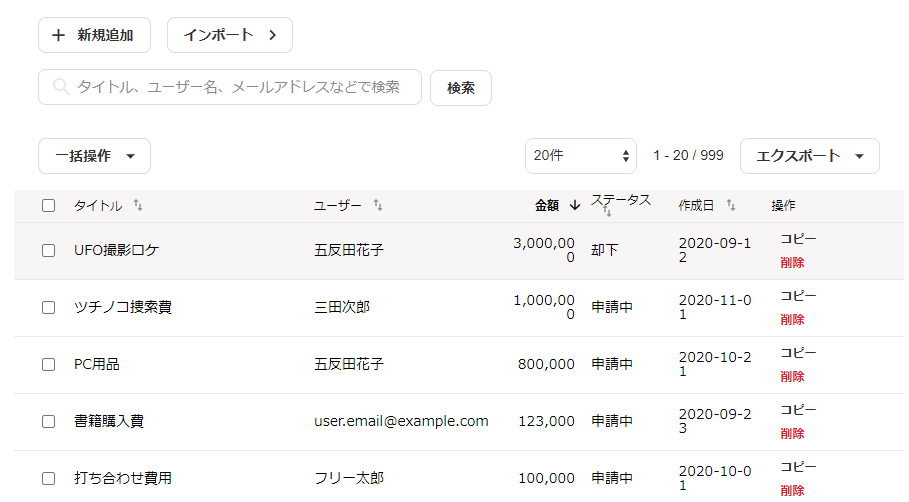
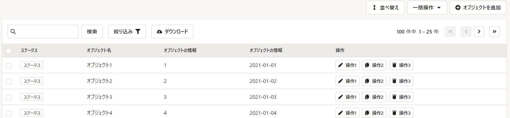
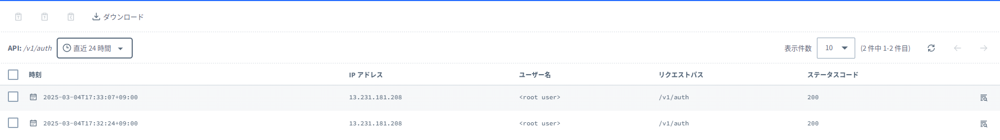

# コンポネントのまとめ

コンポネントの方針を整理するために作成しています。

こちらのREADMEはワーク用です。あとで StoryBook に移行するなど共有方法は変更します。

## はじめに

新アーキテクチャで利用するコンポネントを整理します。

そのコンポネントを使用用途、設計思想などを整理していき、開発時に悩まないようにしていくためのものです。

コンポネントは、AtomicDesign の考え方を採用し、以下の３つのレイヤーで整理します。

- Level1: Basic Components Atomic 原子
- Level2: Combined Components Module 分子
- Level3: Layout Patterns Atomic 原子

- [コンポネントのまとめ](#コンポネントのまとめ)
  - [はじめに](#はじめに)
  - [Level1: Basic Components](#level1-basic-components)
    - [BUTTONS（ボタン）](#buttonsボタン)
    - [DropdownMenuButton](#dropdownmenubutton)
    - [FilterDropdown](#filterdropdown)
    - [SortDropdown](#sortdropdown)
    - [選択系](#選択系)
    - [ラジオ系](#ラジオ系)
    - [チェックボックス系](#チェックボックス系)
    - [入力エリア](#入力エリア)
  - [Level2: Combined Components](#level2-combined-components)
    - [Table 一覧](#table-一覧)
      - [他社参考](#他社参考)
  - [Level3: Layout Patterns](#level3-layout-patterns)
    - [WORK](#work)

## Level1: Basic Components

コンポーネントとして使える最小の要素。Button, Text, List, TextLink, Label, User Iconなど。 

通常状態ではElevationの差がなく、hoverなどによって初めてElevationが変化する。

> **エレベーションとは**
> 
> ブラウザ上で表示されるコンポーネントの高さの度合いを示します。
> エレベーションのデフォルト値は高さレベル0で、これはエレベーションをもたないコンポーネントのこととなります。
> デフォルト値をもつコンポーネントはブラウザ上で最も低く表示されます。コンテンツエリアに表示されている各種のコンポーネントの上に重なって表示されるダイアログやスナックバーなどのコンポーネントは、他のコンポーネントより高いエレベーションをもつことでオーバーレイ表示されます。
> 参考 : [デジタル庁デザインシステムβ版 v2.1.3](https://design.digital.go.jp/foundations/elevation/)
>

### BUTTONS（ボタン）

サービスで利用するボタン

- STORIES
  - variant
    - secondary : 通常アクション系
    - primary : 業務処理などの処理実行系（青系）
    - danger : データ削除などの処理実行系（赤系）
  - [ ] アイコン ※意味を分けるか
    - アイコンあり :
    - アイコン無し :
  - ステータス
    - 非活性
    - インフォメーション : ボタンの説明、ホバーで説明を表示
    - ローディング : 処理実行中のアニメーション
    - 選択実行処理 : 一つのボタンでアクションを分割する場合

[SmartHR UI BUTTONS](https://story.smarthr-ui.dev/?path=/docs/buttons%EF%BC%88%E3%83%9C%E3%82%BF%E3%83%B3%EF%BC%89-button--docs&globals=backgrounds.grid:!false;)

### DropdownMenuButton

一覧の一括処理系のボタン

[SmartHR UI DropdownMenuButton](https://story.smarthr-ui.dev/?path=/docs/buttons%EF%BC%88%E3%83%9C%E3%82%BF%E3%83%B3%EF%BC%89-dropdownmenubutton--docs&globals=backgrounds.grid:!false;)

### FilterDropdown

一覧の絞り込みボタン

[SmartHR UI FilterDropdown](https://story.smarthr-ui.dev/?path=/docs/buttons%EF%BC%88%E3%83%9C%E3%82%BF%E3%83%B3%EF%BC%89-filterdropdown--docs&globals=backgrounds.grid:!false;)

### SortDropdown

一覧のソートボタン

[SmartHR UI SortDropdown](https://story.smarthr-ui.dev/?path=/docs/buttons%EF%BC%88%E3%83%9C%E3%82%BF%E3%83%B3%EF%BC%89-sortdropdown--docs)

### 選択系

### ラジオ系

単一選択系オブジェクト

TODO:どのような場合に以下を使い分けるか検討する

- ラジオボタン
- 選択可能ボタン
- プルダウン

### チェックボックス系

複数選択可能

### 入力エリア

- 入力オブジェクト種類
  - 単一入力
    - パターン
      - 半角英数全角
      - パスワード
      - メールアドレス
    - 用途
      - テンプレート名
  - 複数行入力
    - 用途
      - テンプレート内容の入力

## Level2: Combined Components

コンポーネントを複数組み合わせて作るコンポーネント。Dropdown, Breadcrumbs, Pagination, Toaster, Form control, Navigationなど。
  
### Table 一覧

#### 他社参考

freee

SmartHR

SORACOM

- 想定機能
  - データ追加
  - 一覧アクション
    - 表示項目変更
    - 一括アクション
      - 列名変換（システム内で利用できるように項目名に変換する）
        - [ ] 未設定箇所がどこかわかるようにする仕組みが必要（多分いらなくなる）
      - インポートエクスポート
      - 一括処理
  - 一覧表示
    - 一覧データ表示（テキスト、区分）
    - ステータス表示
    - アクションボタン（ex. テンプレート編集、音声作成）
  - 実行処理（行単位）
    - 詳細表示
    - 画面遷移
    - 削除
  - 実行処理（列単位）
    - 列名称変更
  - 実行処理（セル単位）
    - ステータス変更
    - データ更新
  - その他機能
    - 絞り込み
      - テキストでの絞り込み
      - 分類での絞り込み（ステータス等）
    - 並び替え
    - ページャ
    - 一覧更新
    - 列ヒント
- 用途
  - 時刻表の一覧表示し、選択した時刻表に対するアクションができる

デザインシステム

- [freee](https://vibes.freee.co.jp/?path=/docs/examples-collection--docs)
- [SmartHr](https://story.smarthr-ui.dev/?path=/story/smarthr-patterns_%E3%82%88%E3%81%8F%E3%81%82%E3%82%8B%E3%83%86%E3%83%BC%E3%83%96%E3%83%AB--default)
- [SORACOM](https://design.soracom.io/design-system/elements/datatable/)

個人的にはソラコムのUIが直感的に感じる

## Level3: Layout Patterns

画面全体に影響を与えるコンポーネント。Modal, Alertなど。

### WORK
